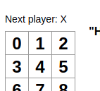

# JavaScript

## Basics

### Difference id and class

`id` is used to identify unique elements in html, whereas `class `can be used to identify more than one. 

### incorporation in html

```html
<html lang="en">
<head>
    <meta charset="UTF-8">
    <meta name="viewport" content="width=device-width, initial-scale=1.0">
    <script src="https://d3js.org/d3.v3.min.js"></script>
</head>
    
<body>  
    <div id="container"></div>
    <script type='text/javascript' src="./basic_1.js"></script> 
</body>    
</html>

```

And in `JavaScript`

```javascript
function plot(params){

}
plot.call(chart, {
    data: data,
    axis:{
        x: xAxis,
        y: yAxis
    },
    gridlines: yGridlines
});

```

### piping in javascript

```javascript
// it is possible to string together
// operations or object callbacks in js
function func(){
    
}
```

### Loops

#### For loops

```
for (let index = 0; index < array.length; index++) {
    const element = array[index];  
}
```

### Call-by-reference and call-by-value

```javascript
function changeStuff(a, b, c)
{
  a = a * 10;
  b.item = "changed";
  c = {item: "changed"};
}

var num = 10;
var obj1 = {item: "unchanged"};
var obj2 = {item: "unchanged"};

changeStuff(num, obj1, obj2);

console.log(num);
console.log(obj1.item);
console.log(obj2.item);

>>> 
.. 10
.. changed
.. unchanged
```

'If you change the **INTERNALS** of the parameter, ***that*** will ***propagate back up*** (as with `obj1`)', however changing the parameters themselves (as with num and obj2), there will be no propagation. 


### Classes

#### Extend

The extend keyword in class definitions are used for ***inheritance***. 

```javascript
class Car {
  constructor(brand) {
    this.carname = brand;
  }
    
  present() {
    return 'I have a ' + this.carname;
  }
    
}

class Model extends Car {
  constructor(brand, mod) {
    super(brand); // ? adds the constructor of the parent class
    this.model = mod;
  }
  show() {
    return this.present() + ', it is a ' + this.model;
  }
}
```


## Extracting data from tables

To extract table data and interact with it seems to be a very pertinent problem for javascript. Imagine a website with an interesting table. Would it not be nice to perform some basic calculations pertaining to this table, interactively in the console?

### Types of tables

Different sites may be implementing different kinds of tables. Universal solutions may therefore be more difficult. The different types of tables include:

##### `<table>` tag. 

1. This can be followed by different tags:
2. `<thead>`
3. `<tfoot>`
4. `<tbody>`
5. Inside each of these tags, the row is formatted by `<tr>` followed by `<td>` which refers to element defining a cell of data

***Column***: is referred to by the `<td>` tag

***Row***: is referred to by the `<tr>` tag

#### Extracting from simple table

the `html` code:

```html
<html lang="en">
<head>
    <meta charset="UTF-8">
    <meta name="viewport" content="width=device-width, initial-scale=1.0">
    <script src="https://ajax.googleapis.com/ajax/libs/jquery/3.5.1/jquery.min.js"></script>
    <style>
        #tableData{
            border: solid;
        }
    </style>
    <title>Document</title>
</head>
<body>

        <table id="RN_TABLE" name="RN_TABLE">
            <tr><td>1</td></tr>
            <tr><td>2</td></tr>
            <tr><td>3</td></tr>
            <tr><td>4</td></tr>
            <tr><td>56</td></tr>
        </table>    

</body>
</html>

```

And the `JavaScript`:

```javascript

function table_process() {
    // The table id in the html document is 'RN_TABLE'
    // It is possible to nest `getElementBy...` 
    // i.e. with the returned object from the `getElement...` it is possible
    // to re-rerun the same method to further filter the object
    
    var table = document.getElementById('RN_TABLE'); 
    var table_d = table.getElementsByTagName('td'); // note how we nest the getElementsBy... method
    var raw_ar = []
    // vanilla for loop
    for (let i = 0; i < table_d.length; i++) {
        // push method appends to array in js
        raw_ar.push(table_d[i].textContent)
    }
    return raw_ar
}		
```

### Operators

#### Question mark

`?` is the ternary operator. It takes three operands:

1. condition followed by
2. `?`
3. then expresstion to execute if the *condition* is truthy 
4. followed by a `:`
5. and finally the expression to execute if the condition is falsy

Example:

```javascript
function getFee(isMember){
    return (isMember ? "2" : "10");
}

console.log(getFee(true));
// outputs: 2

console.log(getFee(false));
// outputs: 10
```

### String manipulation

#### Replacing whitespace

Assume we have the following text

```javascript
let text = ' asd1231 sdsd kr '
text =  text.replace(/\s/g, '').replace('kr', '')
```

### Cache update

To update the cache:

```html
<link rel="stylesheet" href="/static/assets/css/jexcel_v4.css?version=1">
```

add a version number as a url parameter in the end of the href. 

# jQuery

## Basics

### the `$` sign 

In javascript `$` is an uninformative variable name. in jQuery the `$` is a ***jquery function***. `$` is an alias for the function called `jQuery`:

```javascript
$('h1').remove()
// Correspons to
jQuery('h1').remove()
```

#### The jQuery method

The `jQuery()` method can take extremely useful parameters. It is able to query or find HTML elements based on the passed parameters. Subsequently, a jQuery action can be performed on the returned element. 

#### Making queries

Say we have the table 

```html
<table id="RN_TABLE">
    <thead>
        <tr>
            <th>Month</th>
            <th>Savings</th>
        </tr>
    </thead>
</table>
```

##### search by id

To search by id: `$('#RN_TABLE')`

Thus We use the `#` to search by the id

##### search by class

to search by class name: `$('.')`


# NPM

This allows running JavaScript in local servers? It seems that it provides the same functionality as `pip`. 

### Run local server

`>>> npm install -g http-server`

to run the server:

`>>> http-server &`

*Where to do this:* Run these commands in the folder where the javascript we wish to run exists. . .


# D3

### Get started

`index.html` page with following in the `html` head:

```html
<head>
    <meta charset="UTF-8">
    <meta name="viewport" content="width=device-width, initial-scale=1.0">
    <title>Document</title>
    <!-- need to load v3 because of changes in later versions -->
    <script src="https://d3js.org/d3.v3.min.js"></script>
</head>
```

To check whether `d3` has been loaded correctly, run `>>> d3` in the console. 

#### Interacting with DOM (Document Object Model)

##### Adding DOM elements

```javascript
>>> d3.select('body').add('p')
```

will add a paragraph element in the HTML code of the page. 

##### Adding an SVG

```javascript
>>> d3.select("body").append("svg").attr("width", 50).attr("height", 50).append("circle").attr("cx", 25).attr("cy", 25).attr("r", 25).style("fill", "purple");
```

##### Plotting dots
The following code needs to be preceded by a bunch of other code as well. However, we will only discuss this (refer to the `scatter.js` somewhere in the learning folders )
```javascript
var d_ = {
    'x': ["0","1","2","3","4","5"],
    'y': ["0","1","2","3","4","5"]
};

function rn(data){
  svg.append('g')
    .selectAll("dot")
    .data(d3.zip(data.x, data.y)) // the more important line of the code
    .enter()
    .append("circle")
      .attr("cx", function (d) { return x(d[0]); } )
      .attr("cy", function (d) { return y(d[1]); } )
      .attr("r", 10)
      .style("fill", "#69b3a2");

}

// Run the code
rn(d_);

```

Alright, several important stuff is happening above. One very important thing is the way the data is being parsed. `d_` is technically a two dimensional matrix. However, `d3` cant handle it in the way it looks:

```javascript
// CURRENTLY
>>> d_
{…}
x: Array(6) [ "0", "1", "2", … ]
y: Array(6) [ "0", "1", "2", … ]
```

`d3` want it to look like;

```javascript
// HOW d3 WANTS IT TO LOOK
>>> d3.zip(d_.x, d_.y)
(6) […]
0: Array [ "0", "0" ]
1: Array [ "1", "1" ]
2: Array [ "2", "2" ]
3: Array [ "3", "3" ]
4: Array [ "4", "4" ]
5: Array [ "5", "5" ]
length: 6
```

we achieve that by `d3.zip` the two vectors in the `d_` object


# React

## Installation

### Starting project

```shell
npx create-react-app my-app
```

#### Empty src

Empty the `src` folder. Here we can add `index.css` and `index.js`, which is in the main project folder. 

#### imports

```js
import React from 'react';
import ReactDOM from 'react-dom';
import './index.css';
```


### Errors

#### Creating in windows running in linux

We had an issue starting a project that was had been npx-started in windows and then cloned to a linux system. The problem associated with the `modules` not being installed on the linux system. This is solved by npm install inside the project folder. 

## Components

React is nice for building user-interfaces. Implements **components**. 

* With components, **we tell react what we want to see on the screen**:
* When our data changes, react will update and re-rennder our components


### React.Component

```javascript
class ShoppingList extends React.Component {
  render() {
    return (
      <div className="shopping-list">
        <h1>Shopping List for {this.props.name}</h1>
        <ul>
          <li>Instagram</li>
          <li>WhatsApp</li>
          <li>Oculus</li>
        </ul>
      </div>
    );
  }
}

// Example usage: <ShoppingList name="Mark" />
```

Here ShoppingList is:

* React component class, 
* or React component type
* !! A component takes in parameters, called **props** (short for properties)
* returns a hierarchy of views to display via the **render method**


#### render method

Very important part of the `React.component`

* returns a *description* of what we wabt to see on teh screen
* react takes teh description, displays the result
* in particular, `render` returnsa **React element** which is a lightweight description of what to render.


#### Constructor

***Must contain***

* `super(props);`: This is required when doing constructors in react components.


#### state

Situation where we want the component to store a value, as in **remembering a state change**, for instance after a click. 


***To use the state***

* define a `constructor(props)` (corresponds to `__init__` in python)
* make sure to `super(props)`


```javascript
class Square extends React.component {
	constructor(props){
		super(props);
		this.state = {
			value: null,
		};
	}
    
    render (
    
        <button 
          className="square" 
          onClick={() => this.setState({value:'X'})}
        >
          {this.state.value}
        </button>
      );
    )
}
```

***setState method***

* This is an inherited method where we can change the `this.state` variable
* !! NOTE: `this.state` is used just like `self` in python, where it is accessible privately across the entire class!
  * means that we can call this

### props

This is how we pass values to components, from inside javascript methods.

```javascript
class Square extends React.Component {
    render() {
      return (
        <button className="square">
        </button>
      );
    }
  }

class Board extends React.Component {
  renderSquare(i) {
    return <Square />;
  }
```

Note here that `js classes` that `extend` `React.component` can be called by simply providing the classname inside a component tags: <>, i.e. `<Square />. 

```javascript
class Square extends React.Component {
    render() {
      return (
        <button className="square">
          {this.props.value} // how we access the passed parameter
        </button>
      );
    }
  }

class Board extends React.Component {
  renderSquare(i) {
    return <Square value={i} />;
  }
```


To pass a parameter to a `React.component` when using the `<"classname">` we need to implement the following syntax: 

```javascript
// To pass parameter 'value'
<Square value = {i} />

// Inside the class
this.props.value
```

|  |      |      |
| ------------------------------------------------------------ | ---- | ---- |
| After passing `this.props.value`                             |      |      |


### JSX syntax

* these structures easier to write
* the `<div />` syntax is TRANSFORMED at build time to `React.createElement('div')`

The above example is therefore equivalent to:

```javascript
return React.createElement('div', {className: 'shopping-list'},
	React.createElement('h1', /*... h1 children ...*/),
	React.createElement('ul', /*... ul children ...*/)
);
```


JSX comes with the full power of JavaScript. You can put *any* JavaScript expressions within braces inside JSX

The `ShoppingList` component above only renders built-in DOM components like `<div />` and `<li />`. But you can compose and render custom React components too. For example, we can now refer to the whole shopping list by writing `<ShoppingList />`


## Tutorial

### Tic-tac-toe

